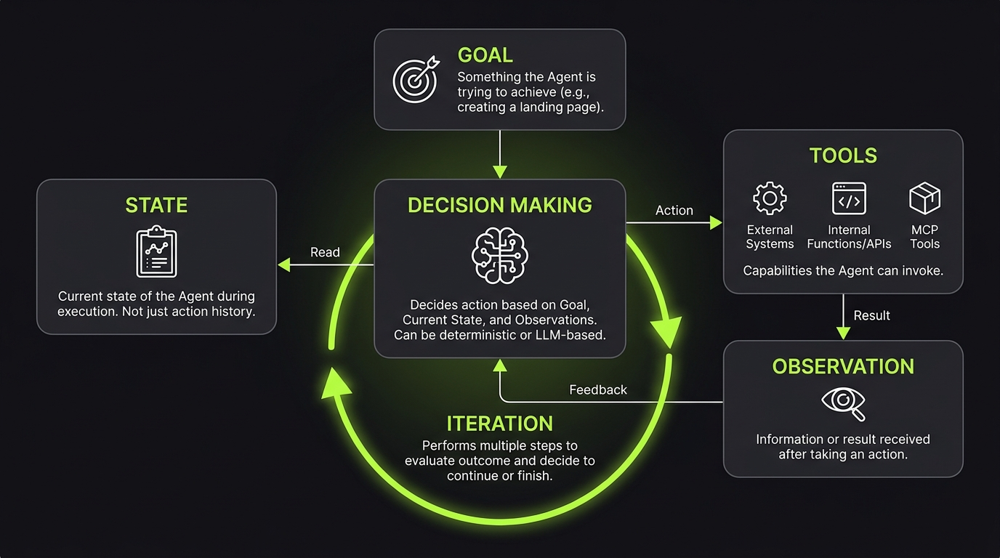

# What Is an Agent?

An Agent is a system that uses an LLM to make decisions and take actions to achieve a goal.

An Agent adds things around the LLM:

`User → Agent → LLM → Action → Observation → LLM → ...`

Imagine an automated workflow, Agent is really look like a flow with a big different thing: Agents have a non-deterministic flow but automations have a deterministic flow which is why Agents useful when we don't have a predfined path.

## Agent vs. Workflow

An Agent can look like an automated workflow, but there is one key difference: **who decides what happens next?**

In a workflow, the developer defines the execution path:

`File → Extract → Count Words → If > 300 → Good Article`

In an Agent, the developer defines the goal, while the Agent dynamically decides the next action based on its goal, state, and observations:

`Goal → Decide → Act → Observe → Decide → ...`

So:

- **Workflow:** Developer controls the flow.
- **Agent:** Agent dynamically controls the flow.

This makes Agents useful when the path to the goal cannot be fully predefined.

## What Makes a System an Agent?

There is no single universal definition, but an Agent usually has these characteristics:

- **Goal** — something the Agent is trying to achieve, such as creating a landing page.
- **Decision Making** — it can decide what action to take based on its goal, current state, and observations. Some decisions can be deterministic, while others can be LLM-based.
- **Tools** — capabilities the Agent can invoke, such as external systems, internal functions, APIs, or MCP tools.
- **State** — the current state of the Agent during execution. This is not simply the history of actions.
- **Observation** — the information or result the Agent receives after taking an action and uses to decide what to do next.
- **Iteration** — it can perform multiple steps instead of generating a single response. This allows the Agent to evaluate the outcome of its actions and decide whether to continue or finish.

For example, consider a simple customer support Agent.

The user says:

`"Where is my order?"`

The Agent might:

`User Request` → `Understand Goal` → `Decide Action` → `Call Order API` → `Observe Result` → `Decide What to Do Next`

If the information is sufficient, the Agent finishes:

`Decide` → `Respond`

If it is not, the Agent can continue:

`Decide` → `Take Another Action` → `Observe` → `Decide` → `...`

The important part is that the Agent is not simply generating an answer. It is **deciding, acting, observing, and iterating based on its goal, current state, and available information**.
