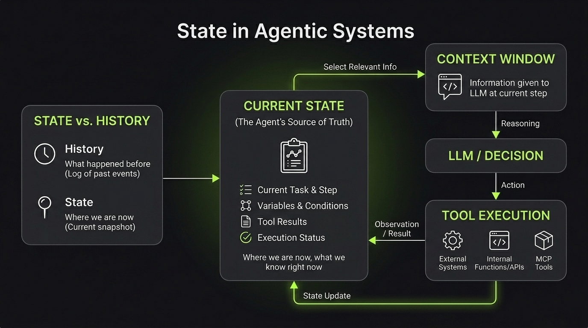

# What Is State?

State is the **current information about the Agent and its execution**.

It represents where the Agent is right now, what it knows about the current execution, and what it needs to continue (this really matters).

For example:

- Current task
- Current step
- Selected tool
- Tool results
- Conditions
- Variables
- Errors
- Execution status

A simple example:

`User Request → Search Tool → Results → Filter Results`

The state might look like:

```text
{
  task: "Find the cheapest flight",
  current_step: "filter_results",
  search_results: [...],
  selected_flight: null,
  status: "running"
}
```

As the Agent moves through the flow, the state changes:

`State → Decision → Action → Observation → State Update → ...`


## State Is Not History

State represents the **current state**, not everything that happened before.

For example, the current state might be:

`{ current_step: "select_flight", search_results: [...], selected_flight: null }`

While the execution history could contain:

`1. User requested a flight → 2. Agent called flight_search → 3. Flight search returned 10 results → 4. Agent filtered the results`

History tells us **what happened**.

State tells us **where we are now**.


## State vs. Context

State and Context are also different.

**State** is the information maintained by the Agent during its execution.

**Context** is the information we provide to the LLM at a particular step.

Some parts of the State may be included in the Context, but they are not the same thing.

`State → Select relevant information → Context → LLM`




## Why Is State Important?

Without state, a multi-step Agent would have difficulty knowing what has already happened and what it should do next.


## Key Takeaway

**State is the Agent's source of truth about its current execution.**

It tells the Agent:

- **Where am I?** → current step and execution status
- **What do I know?** → relevant data and tool results
- **What has happened?** → the information needed from previous steps
- **What do I need to do next?** → the information required for the next decision


## References & Further Reading

- [State and Memory is All You Need for Robust and Reliable AI Agents](https://arxiv.org/abs/2507.00081)
  - Explores how explicit state and memory can improve the reliability and robustness of long-running AI agent workflows.
