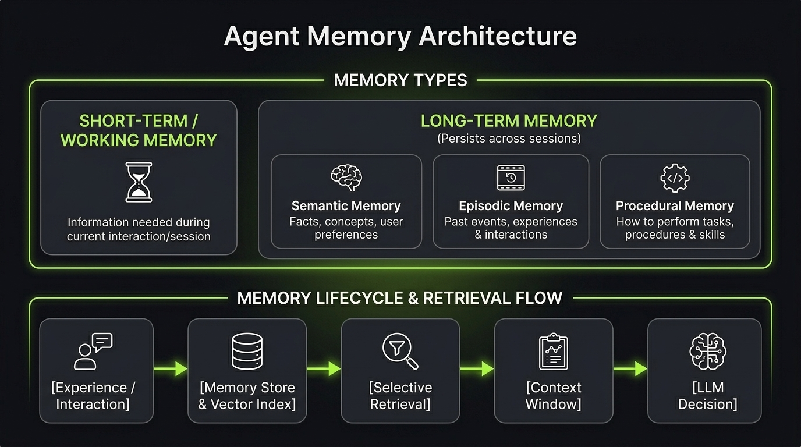

# What Is Memory?

In simple way Memory is the information an Agent **stores and can retrieve later** to use in future interactions or executions.

The main difference from State is that **State represents the current execution**, while Memory is information we **intentionally** keep beyond the current execution.

A simple example:

The user tells the Agent:

`"I prefer dark themes for my websites."`

The Agent can store this as memory:

`{ preference: "dark themes" }`

Later, in another conversation:

`User → Create a landing page`

The Agent can retrieve that memory and use it:

`Memory → User prefers dark themes → Context → LLM`

## Why Do Agents Need Memory?

Without memory, it will be like Lost Soul. An Agent may have to rediscover the same information every time.

Memory allows an Agent to:

- Remember user preferences and facts about the user.
- Remember relevant information from previous interactions.
- Store useful experiences from previous executions.
- Influence future decisions and behavior.
- Personalize future responses and actions.
- Persist useful information across sessions.

## Memory vs. History

Memory is also different from simply storing everything that happened.

**History** records previous events or interactions.

**Memory** contains information that we intentionally keep because it may be useful later.

For example:

`History → User said: "I prefer dark themes."`

`Memory → User prefers dark themes.`

Memory can therefore be created from conversations, events, observations, or experiences.

## Memory Types

Memory can be classified in different ways.

### Based on Persistence

- **Short-term / Working Memory** — information needed during the current interaction or execution.
- **Long-term Memory** — information that persists across interactions or executions.

### Based on Information Type

- **Semantic Memory** — facts, concepts, preferences, and other structured information.
- **Episodic Memory** — specific events, interactions, and experiences.
- **Procedural Memory** — information about how to perform tasks or procedures.

These categories are not mutually exclusive. For example, semantic or episodic memories can be stored as long-term memory.
These categories can overlap depending on the system design.

## Memory Is Not Knowledge

Memory and Knowledge are also different.

**Knowledge** is information the Agent can retrieve to answer questions or perform tasks.

**Memory** is information related to previous interactions, experiences, or information the system has intentionally decided to retain.

For example:

`Knowledge → "How does Webito's pricing work?"`

`Memory → "This user prefers the €38 plan."`

## Summary

Memory is not just a database of everything the Agent has seen.

It is information that the system **intentionally retains and can retrieve later** to improve future decisions and interactions.

The key distinction is:

`State → What is happening now?`

`History → What happened before?`

`Memory → What should we remember for later?`

`Context → What information do we give the LLM right now?`

`Knowledge → What information can the Agent retrieve about the world or a domain?`

A useful mental model is:

`Experience → Memory → Retrieval → Context → LLM → Decision`

The important part is that **memory is not automatically useful just because we store it**. We need to decide what is worth remembering, when to store it, how to retrieve it, and how to use it without polluting the Agent's context.
